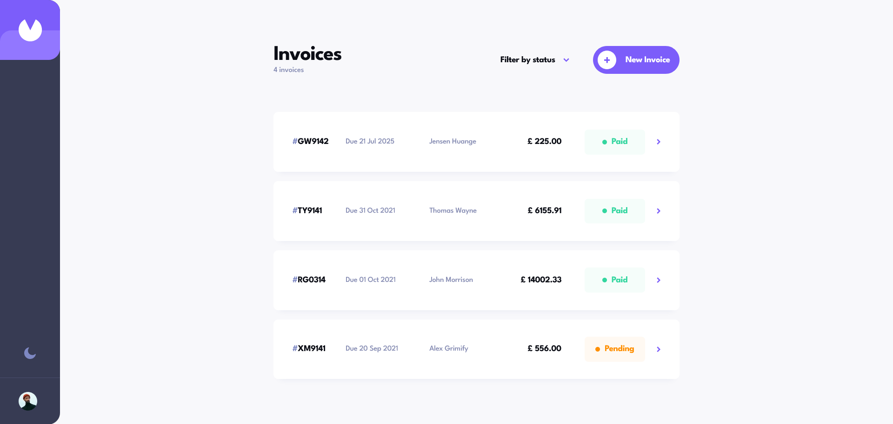

# Frontend Mentor - Invoice app solution

This is a solution to the [Invoice app challenge on Frontend Mentor](https://www.frontendmentor.io/challenges/invoice-app-i7KaLTQjl). Frontend Mentor challenges help you improve your coding skills by building realistic projects.

## Table of contents

- [Overview](#overview)
  - [The challenge](#the-challenge)
  - [Screenshot](#screenshot)
  - [Links](#links)
- [My process](#my-process)
  - [Built with](#built-with)
  - [Useful resources](#useful-resources)
- [Author](#author)

## Overview

### The challenge

Users should be able to:

- View the optimal layout for the app depending on their device's screen size
- See hover states for all interactive elements on the page
- Create, read, update, and delete invoices
- Receive form validations when trying to create/edit an invoice
- Save draft invoices, and mark pending invoices as paid
- Filter invoices by status (draft/pending/paid)
- Toggle light and dark mode
- **Bonus**: Keep track of any changes, even after refreshing the browser (`localStorage` could be used for this if you're not building out a full-stack app)

### Screenshot

### Links

- Solution URL: [https://www.frontendmentor.io/solutions/invoice-app-with-nextjs-swr-graphql-mhqO4lzWjs](https://www.frontendmentor.io/solutions/invoice-app-with-nextjs-swr-graphql-mhqO4lzWjs)
- Live Site URL: [https://invoice-app-fem.vercel.app/](https://invoice-app-fem.vercel.app/)

## My process

### Built with

- HTML5
- CSS
- Mobile-first workflow
- [shadcn/ui](https://ui.shadcn.com/) - set of beautifully-designed, accessible components
- [Next.js](https://nextjs.org/) - React framework
- [TailwindCSS](https://tailwindcss.com/) - For styles
- [SWR](https://swr.vercel.app/) - For data fetching / mutations
- [GraphQL](https://graphql.org/)

### Useful resources

- [shadcn/ui](https://ui.shadcn.com/) - This helped me create the UI for this application.

## Author

- Website - [https://eljohnbonga.vercel.app/](https://eljohnbonga.vercel.app/)
- Frontend Mentor - [@eljohn316](https://www.frontendmentor.io/profile/eljohn316)
- Github - [https://github.com/eljohn316](https://github.com/eljohn316)
